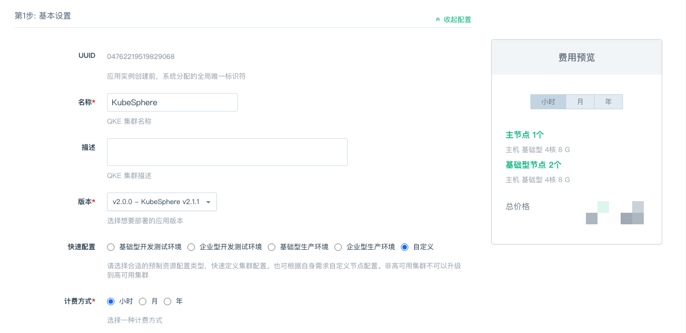

## How to Reproduce

### Login 

Sign in to [QingCloud Console](https://console.qingcloud.com/) with you own account.

### Create QKE Cluster

Navigate to QKE cluster, choose ap2a/ap3 region, and create QKE cluster according to [QKE User Guide](https://docs.qingcloud.com/product/container/qke/index).



>> Note:
>> please choose ap2a or ap3 region to avoid network issues when pulling gcr.io images.

### Run conformance tests

- Copy Kubeconfig to your local test host

- Start the conformance tests on your local test host

```shell
sonobuoy run \
  --mode=certified-conformance \
  --kubeconfig=path/to/kubeconfig \
```

You can monitor the conformance tests by tracking the sonobuoy logs. Wait for the line no-exit was specified, sonobuoy is now blocking, which signals the end of the testing.

```shell
sonobuoy logs --kubeconfig=path/to/kubeconfig -f
```

Upon completion of the tests you can obtain the results by copying them off the sonobuoy pod.

```shell
OUTPUT_PATH=$(sonobuoy retrieve --kubeconfig=path/to/kubeconfig)
echo ${OUTPUT_PATH}
mkdir ./results
tar xzf ${OUTPUT_PATH} -C ./results
```
